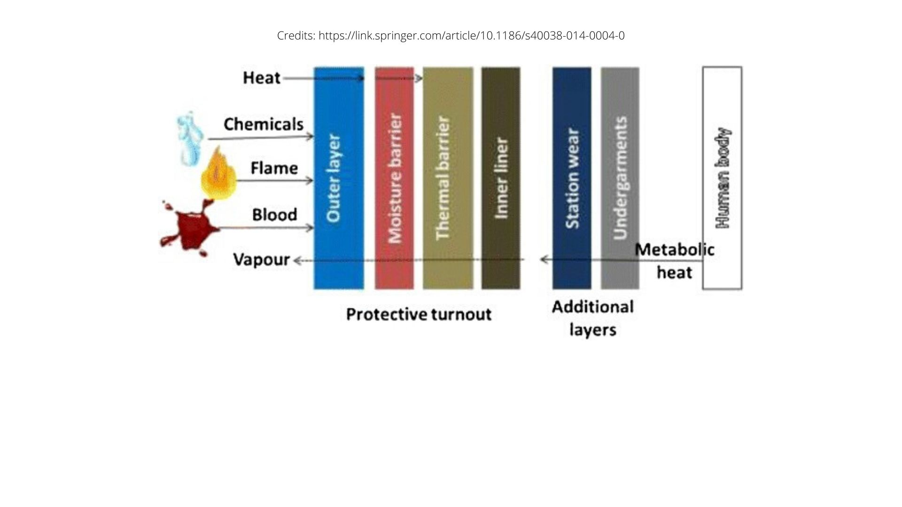
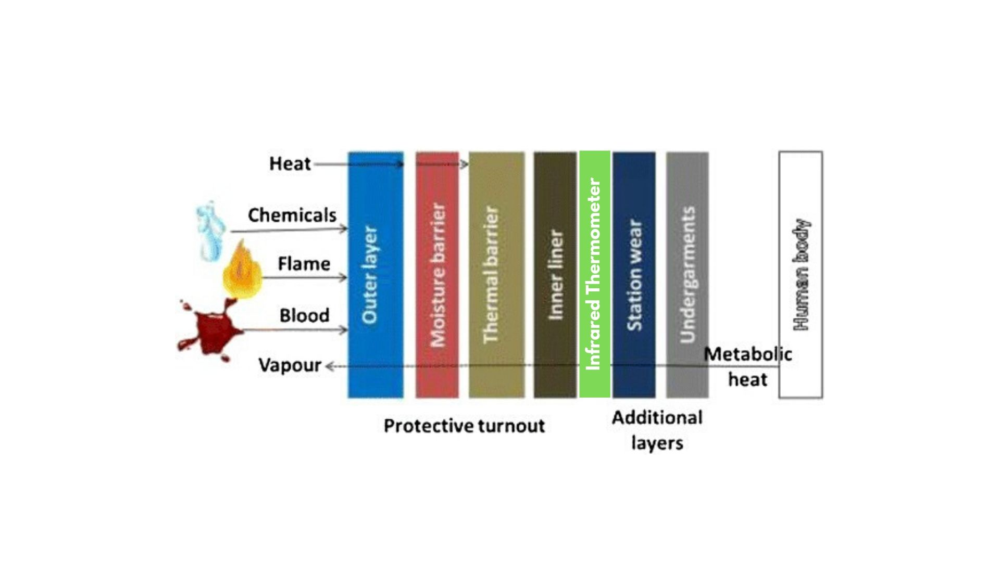
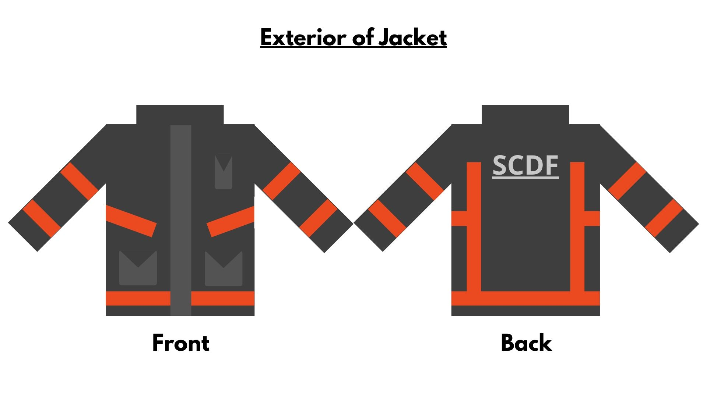
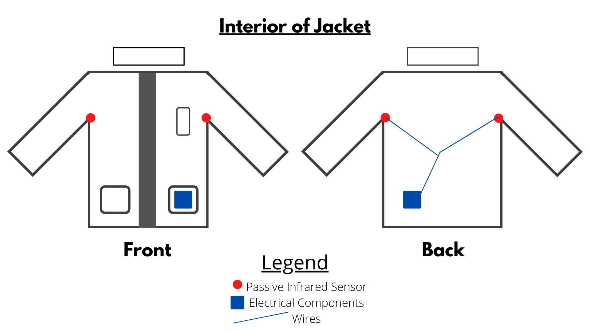
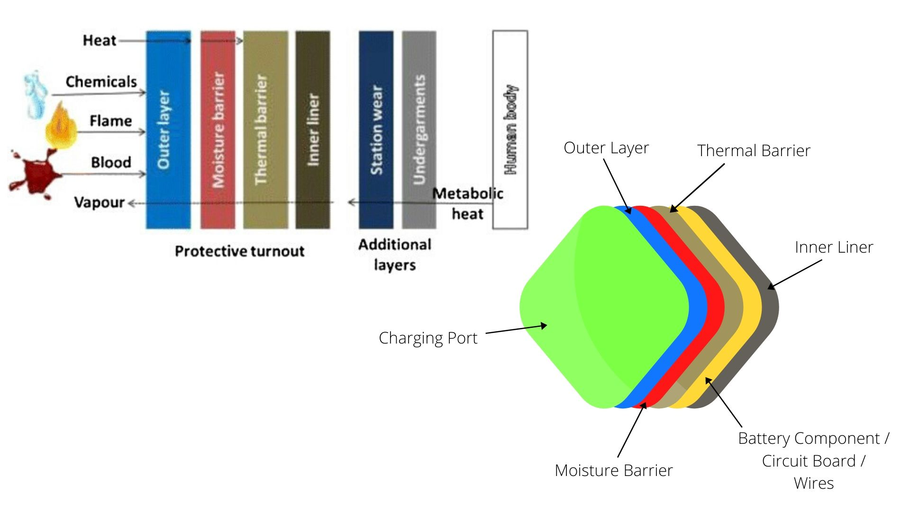

# SCDF x IBM: Call for Code 2020

## Team Name: Weathering-Storms
## Project Name: Smart Suit
## Team Members: Lee Kuan Wei, Pang Kai Yi

We are "Weathering-Storms", and we participated in SCDF x IBM: Call for Code 2020 because we wanted to be able to impact our society through our passion of technology. When we heard about the hackathon, we jumped at the opportunity as we wanted to learn more about the issues we were facing in Singapore.

## What is the problem?

When we received the brief, we decided to tackle problem statement 2, Climate Change. The problem statement is as follows:

"Climate change is inevitable, with projected increase in temperatures leading to phenomena such as the Urban Heat Island effect. This leads to an environment and climate where it is increasingly physically challenging for First Responders to train and operate to maximum efficiency and performance. How might SCDF leverage wearables or other technologies to provide relief or enhancement in harsh operating conditions and maximise the safety, health and performance of First Responders during training and operations?"
________________________________________________________________________________________________________________________________________

With Climate change increasing global temperatures, and being in tropical Singapore, we are experiencing increasing daily average temperatures. Along with the Urban Heat Island Effect (https://en.wikipedia.org/wiki/Urban_heat_island), we are exposed to higher than normal ambient temperatures. It is also clear that through data, average annual temperatures have been on a rise (http://www.weather.gov.sg/climate-past-climate-trends/). This is a problem for us, but more so for out responders.

Firefighers are made to operate in harsh conditions to tackle the issues of fire and rescue. The nature of their job subjects them to the dangers of high physical demands and extreme heat. The protective equipment they wear to protect themselves from fires also restrict body heat from escaping their bodies, this along with intensive physical labour forces the body to perspire excessively. Through prolonged training or operations, they become susceptible to heat injury at the incident scene. This is further exaggerated when they are in close vicinity to fires, which drastically increases the ambient temperatures.

### Why did we choose this problem?

As Singapore Citizens, we have undergone National Service and have experienced rigorous training and have seen our peers suffer through heat injuries. Often times, we are unaware that our personnel are going through such circumstances until it is too late and they are already suffering from heat injury.

As a result, we decided that technology can be used as a way to curb the problem of not being able to detect any personnel about to experience heat injury. This way, we can gain the confidence of pushing them as part of training but not to the point where they have to suffer debilitating injuries. Simply put, we can ensure their safety while maximizing efficiency and effectiveness of the training.

### How can technology help?

By leveraging on data collection, analysis, and artificial intelligence, we are able to make better informed decisions to solve the problem at hand. As the job of responders often deal with lives-at-stake, it is essential that we are able to make the best decision before and during the operation to provide the casualty with the highest chance of survival. Therefore, it is imperative that we use technology to aid us in simplifying difficult decisions.

Additionally, as the lives of responders are just as important as those that they are trying to save, we need to be confident that we do not suffer casualties of our own during operations. This is where technology can be used to provide that boost of confidence in our responders, allowing us to more efficiently complete the job at hand.

## What is your team's idea?

Through the use of Internet of Things (IoT), we decided to use temperature sensors to track the body temperature of each firefighter during training and in operation. By tracking each individual's body temperature, the commander-in-charge can be alerted of any personnel being at high risk of heat injury. Precautionary action can then be taken, pulling the personnel out before he/she experiences heat injury.

The data is collected through a system within each firefighter and are sent to IBM Cloud, where it can analyzed and plotted on a real-time graph. With the information in the cloud, the commander simply has to connect to the cloud using his phone or any external device to access the information. This provides crucial information through visual graph and is also capable of large-scale monitoring of multiple firefighters simultaneously.

## Situational Analysis

### Infrared Thermometer

It is commonly taught that we can help reduce core body temperature by cooling the areas around the neck, underarms, and the forehead. Therefore, we realized that it would be a good indicator if we can identify the core body temperature of the responder through any of these 3 areas. We chose the underarms as it is the area with the highest body temperature due to the use of the bunker gear, and it is where we will place our infrared thermometers to check their temperature.

As per the image above, we can see the cross-section of our typical bunker gear. Focusing on the right-side of the image, note that our metabolic heat is mostly stopped once it reaches our inner lining of the bunker gear. This is also where we will embed the infrared thermometer, into the fabric of the inner liner (shown below). This placement of the infrared thermometer provides us with multiple advantages:

1. No additional action required by the firefighters during operation (convenience, no change to routine)
2. Protected from external heat, reduces chances of inprecise measurements (hidden behind the thermal barrier, the heat detected would be from the firefighter's body heat only)
3. Accurate readings (as it is still within the metabolic heat region, it can provide accurate readings of the firefighter's body temperature)

### Outline of IoT device in the jacket

As per the images shown above, this is the basic outline that our team has proposed. The whole system is discrete and cannot be differentiated from the normal jacket from the outside. The infrared thermometers are located at the underarm area of the jacket and the wiring would go through the back of the jacket. It would then be connected to the other electrical components that are required for the system to work, they are as follows:

1. Arduino Uno Board
2. IoT SIM Card
3. Rechargeable Lithium-Ion Battery
4. Charging Port
5. On/Off Switch
6. Wires

Components 1, 2, and 3 should be soldered together and kept in a water-proof casing inside the fabric of the jacket. Components 4 and 5 are then connected via wiring through the fabric to the insides of the left pocket at the front. This is shown below.

You can see that the Charging Port & Switch (colour-coded green) are on the outside, but is still protected by the pocket lining. These components have to be outside to provide easy access for each personnel to activate the system and charge whenever neccessary.

The other electrical components (colour-coded yellow), are located within the fabric of the jacket and are protected from moisture and heat by the fabrics of the jacket. This is to ensure the safety and longevity of the main components of the IoT system.

## Possible Shortcomings

### Infrared Thermometers

As with the design of many temperature sensors, they often have short range and their accuracy can vary widely due to the range of the object they are sensing. Therefore, there is a need to invest in higher quality sensors so as to fit the brief of being able to detect small temperature changes of just a couple of degrees.

Additionally, as the physique and choice of jacket size is dependent on each individual firefigher, the distance from the sensor to the body of each individual can vary widely. It is then important to have each system checked and calibrated accordingly as the systematic error for each device is different due to the sensor itself, and the distance from the sensor to the body of the firefighter.

Note that Passive Infrared (PIR) Sensors should be avoided as they have multiple shortcomings to them:
1. They often emit simple binary signals to the system
2. They are mostly used as motion detectors due to reason 1
3. They are not precise in temperature readings which are essential for our use

### Sensors embbed in the jacket

With the sensor being embedded in the jacket, it is easy for the sensor to be dislodged due to the numerous movements each firefigher would have to make during operation. As a result, it is helpful for the sensor to be installed together with physical 'stoppers' that can restrict movement of the sensor itself, increasing longevity of the system.

The movement of the individual would also cause the sensor to continuously move, changing the target object it is detecting temperature from. This change can create big fluctuations in the data collected, causing inaccuracies in the system. One way to reduce the impact of that could be to place higher priority and importance on ambience temperature as compared to direct object detection.

## Results

The whole IoT system relies heavily on IBM Cloud to collect, process, and analyze the data provided by the sensors in each individual firefigher. With additional calibrations made to reduce systematic errors and highlight key individuals that have reached critical body temperatures, this system can aid with ensuring each firefighter is well monitored and are not subjected to the preventable dangers of heat injury. The safety of each responder is of our utmost priority, and having this system would ensure that they do not get injured unnecessarily.
