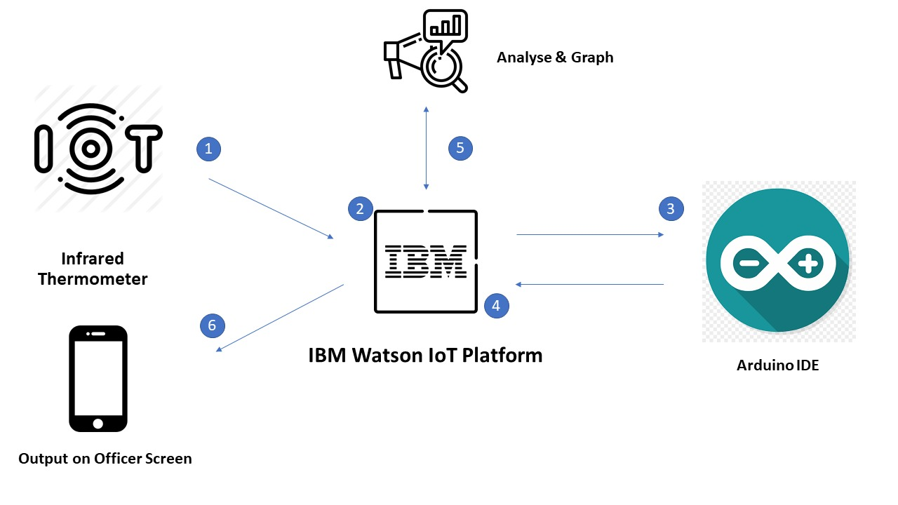

# Weathering-Storms: Smart Suit
## Team Members: Lee Kuan Wei, Pang Kai Yi

[](https://www.apache.org/licenses/LICENSE-2.0)

We are "Weathering-Storms", and we participated in SCDF x IBM: Call for Code 2020 because we wanted to be able to impact our society through our passion of technology. When we heard about the hackathon, we jumped at the opportunity as we wanted to learn more about the issues we were facing in Singapore.

## Contents

1. [Description](#description)
1. [Long Description](#long-description)
1. [Video Pitch](#video-pitch)
1. [Architecture of proposed solution](#architecture-of-proposed-solution)
1. [Getting started](#getting-started)
1. [Built with](#built-with)
1. [Contributing](#contributing)

## Description

### What is the problem?

With Climate change increasing global temperatures, and being in tropical Singapore, we are experiencing increasing daily average temperatures. Along with the Urban Heat Island Effect, we are exposed to higher than normal ambient temperatures.

Firefighers are made to operate in harsh conditions to tackle the issues of fire and rescue. The nature of their job subjects them to the dangers of high physical demands and extreme heat. The protective equipment they wear to protect themselves from fires also restrict body heat from escaping their bodies, this along with intensive physical labour forces the body to perspire excessively. Through prolonged training or operations, they become susceptible to heat injury at the incident scene. This is further exaggerated when they are in close vicinity to fires, which drastically increases the ambient temperatures.

### How can technology help?

By leveraging on data collection, analysis, and artificial intelligence, we are able to make better informed decisions to solve the problem at hand. As the job of responders often deal with lives-at-stake, it is essential that we are able to make the best decision before and during the operation to provide the casualty with the highest chance of survival. Therefore, it is imperative that we use technology to aid us in simplifying difficult decisions.

### What is your team's idea?

Through the use of Internet of Things (IoT), we decided to use temperature sensors to track the body temperature of each firefighter during training and in operation. By tracking each individual's body temperature, the commander-in-charge can be alerted of any personnel being at high risk of heat injury. Precautionary action can then be taken, pulling the personnel out before he/she experiences heat injury.

The data is collected through a system within each firefighter and are sent to IBM Cloud, where it can analyzed and plotted on a real-time graph. With the information in the cloud, the commander simply has to connect to the cloud using his phone or any external device to access the information. This provides crucial information through visual graph and is also capable of large-scale monitoring of multiple firefighters simultaneously.

## Long description

[Please click here to access the full proposal](DESCRIPTION.md)

## Video Pitch

![][Watch the video!](https://youtu.be/XFW-n1bk9-Y)

## Architecture of proposed solution



1. Sensors export data to IBM Internet of Things Platform to store.
2. User navigates to the site and requests for data.
3. IBM Internet of Things Platform processes data from numerous sensors.
4. IBM Internet of Things Platform analyzes and plots graphs.
5. IBM Internet of Things Platform sends requested data to User.

## Getting started

These instructions will get you a copy of the project up and running on your local machine for development and testing purposes. While there are many steps in establishing a connection between the IoT device and IBM's cloud, it ensures smooth flow of information once we start programming the IoT device itself.

### Installation

You will need to install the required software as shown below:

```bash
dnf install wget
wget https://www.arduino.cc/en/main/software
wget https://projects.eclipse.org/projects/iot.paho/downloads
curl -LO https://github.com/ibm-messaging/iot-arduino.git
```
To load Paho mqtt into Arduino IDE, download the zip file but do not unzip it
In Arduino IDE, click on 'Select Sketch' -> 'Import Library' -> 'Add to Library' (select the zip file)

Once the software have been installed, connect Arduino Uno to your computer
The samples folder of this repository (https://github.com/ibm-messaging/iot-arduino) contains 2, folders each containing 1 flow –
1. Quickstart flow
2. Registered flow
Compile the 2 sketch codes (corresponding to the flows)
Depending upon the requirement, push one of the flows to the Arduino device

### Connection with IBM Watson IoT Platform

Using the Sketch program, key in the following code. Look at the lower part of the Sketch pad window to check that the COM connection is shown as active.

```bash
#include <Wire.h>
#include <Adafruit_MLX90614.h>

Adafruit_MLX90614 mlx = Infrared Thermometer();

void setup() {
  Serial.begin(9600);

  Serial.println("Infrared Thermometer Display");  

  mlx.begin();  
}

void loop() {
  Serial.print("Ambient = "); Serial.print(mlx.readAmbientTempC()); 
  Serial.print("*C\tObject = "); Serial.print(mlx.readObjectTempC()); Serial.println("*C");

  Serial.println();
  delay(3000);
}
```
Through the whole set of code, we have started the system and the sensor have begun collecting data.
The data is collected in 3 second intervals and would output the ambient temperature and object temperature in Celsius.
Check if the information is shown as we expected.

### IBM Watson IoT Platform

To enable us to use IBM Watson IoT Platform, we would need to setup and register our device into the cloud network.

Use the following guide to register the device into IBM Watson Internet of Things Platform (https://developer.ibm.com/recipes/tutorials/how-to-register-devices-in-ibm-iot-foundation/).

1. During the device registration process, you will receive file configuration information with the following information:
                Organization ID, Device Type, Device ID, Authentication Method, Authentication Token
2. Copy this information to the clipboard to use in the configuration file.
3. Use the device credentials obtained during registration to modify the fields in the Sketch code
4. Save the configuration file in the sketch program.

Disclaimer:

By default, the Watson IoT Platform only accepts secure connections. So, unless the sketch program has been configured, the Arduino device, by default initiates Insecure connection to Watson IoT Platform. In such cases, you might experience connectivity issues while initiating the connection between the device / gateway & WIoTP.

However, to facilitate all connections ( both Secure and Insecure)  to WIoTP, the Platform provides a security configuration, that helps you to take a well informed decision to allow Insecure connections, under your supervision.

### Data Visualization

Now that a connection between the device and Watson IoT Platform has been established, we can begin to use the IoT Platform to perform analysis for us. We can start to create visualization charts for the real time data from the sensors.

With that completed, we have successfully connected the device with IBM's cloud and are able to extract and analyze the data for us to better understand the situation.

## Built with

* [IBM Internet of Things Platform](https://cloud.ibm.com/catalog?search=internet%20of%20things%20platform#search_results) - IoT        platform for coordinating data
* [Arduino](https://github.com/arduino/Arduino) - IoT software and hardware

## Contributing

Please read [CONTRIBUTING.md](CONTRIBUTING.md) for details on our code of conduct, and the process for submitting pull requests to us.
